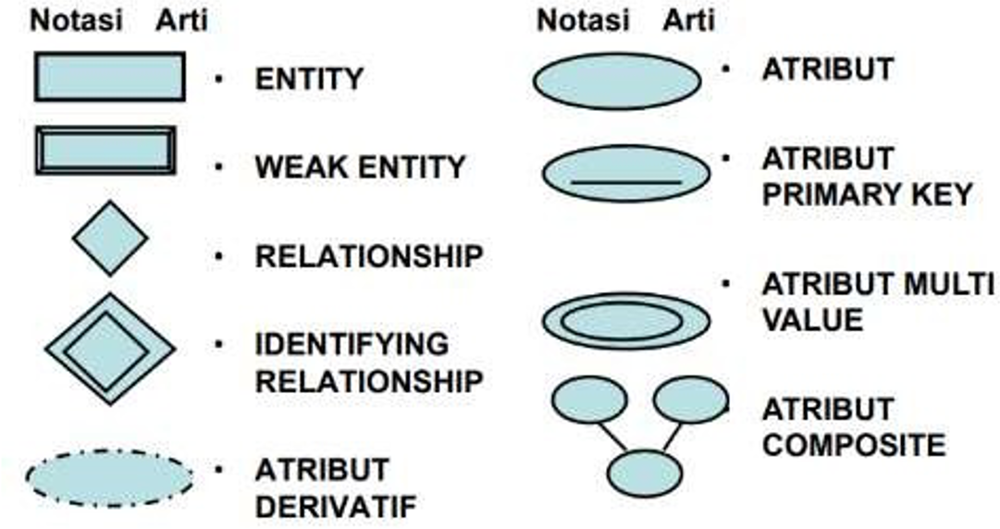
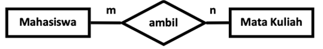

# Modul Kuliah Minggu Ke 3 - Konsep ERD (Entity Relationship Diagram) dan database design

Dosen Pengampu : **Arif Wicaksono Septyanto**<br>
Asisten Praktikum : **Sabrina Putri Donita**<br>

Tujuan :
- Mampu memahami dan merancang ERD (Entity Relationship Diagram)

## Pengertian ERD (Entity Relationship Diagram)

*ERD (Entity Relationship Diagram)*, yaitu suatu diagram yang menggambarkan hubungan antar entitas dalam suatu sistem basis data. ERD membantu untuk menentukan entitas, atribut, dan relasi dalam sistem basis data yang akan dibangun.

### Berikut adalah langkah-langkah umum dalam membuat ERD:

1. Identifikasi Entitas: Identifikasi elemen-elemen sistem yang akan dicakup oleh basis data dan tentukan entitas yang relevan
2. Definisi Atribut: Tentukan atribut yang mewakili setiap entitas, yaitu karakteristik yang unik yang membedakan satu entitas dengan entitas lain.
3. Identifikasi Relasi: Tentukan relasi antar entitas yang ada, seperti satu-ke-satu, satu-ke-banyak, dan banyak-ke-banyak.
4. Gambar Diagram: Gunakan simbol standar untuk menggambarkan entitas, atribut, dan relasi pada diagram.
5. Periksa dan Perbaiki: Periksa dan perbaiki diagram untuk memastikan konsistensi dan kelengkapan informasi.
6. Implementasi: Terapkan desain ERD pada sistem basis data dan uji untuk memastikan bahwa sistem bekerja seperti yang diharapkan.

### Simbol - Simbol ERD
Berikut adalah simbol-simbol yang biasanya digunakan dalam Entity Relationship Diagram (ERD):



1. Entitas: digambarkan dalam bentuk persegi panjang, mewakili suatu objek, konsep, atau orang dalam sistem yang dianalisis.
2. Weak Entity : digambarkan dalam bentuk persegi panjang dengan tepian bergaris putus-putus, menunjukkan entitas yang tidak dapat diidentifikasi secara unik tanpa adanya hubungan dengan entitas lain yang disebut owner entity.
   Weak entity dalam Entity Relationship Diagram (ERD) adalah sebuah entitas yang tidak dapat diidentifikasi secara unik tanpa adanya hubungan dengan entitas lain. Weak entity selalu terkait dengan entitas lain yang disebut sebagai owner entity, yang memberikan keterhubungan atau identitas yang diperlukan untuk menentukan identitas dari weak entity.
   
   Contoh umum dari weak entity adalah suatu entitas "order detail" pada sistem penjualan online, yang tidak memiliki identitas yang unik tanpa adanya entitas "order" sebagai owner entity. Identitas order detail hanya dapat diidentifikasi dengan mempertimbangkan owner entity, seperti nomor order, waktu order, dan produk yang dipesan.
   
   Untuk merepresentasikan weak entity pada ERD, digunakan simbol persegi panjang dengan garis-garis putus-putus pada tepiannya. Garis putus-putus ini menunjukkan bahwa entitas tersebut adalah weak entity. Weak entity juga memiliki atribut yang disebut partial key, yang merupakan kombinasi dari atribut dari owner entity dan atribut dari weak entity, yang digunakan untuk mengidentifikasi record weak entity yang spesifik. Selain itu, weak entity juga memiliki hubungan (relationship) dengan owner entity, yang dinyatakan dalam bentuk kardinalitas.
   
   Berikut adalah contoh ERD untuk "order detail" sebagai weak entity:

```scss
Order Entity          Order Detail Entity
-----------------     ----------------------------
| order_id (PK)  |     | order_id (PK, FK)       |
| customer_id    |     | detail_id (PK)           |
| order_date     |     | product_name             |
| total_price    |     | quantity                 |
-----------------     ----------------------------
```

    Dalam contoh di atas, "order detail" adalah weak entity dan "order" adalah owner entity. Weak entity "order detail" hanya dapat diidentifikasi melalui kombinasi dari atribut "order_id" dan "detail_id". Oleh karena itu, "order_id" ditandai sebagai primary key dan foreign key (FK) dari owner entity "order". Relasi antara "order" dan "order detail" adalah one-to-many, karena satu order dapat memiliki banyak detail order, tetapi setiap detail order hanya terkait dengan satu order.

3. Relationship
Simbol relasi digunakan untuk merepresentasikan hubungan antara dua atau lebih entitas dalam sistem. Simbol ini biasanya berupa garis dengan tipe relasi yang berbeda-beda, seperti garis lurus, garis putus-putus, atau garis bergelombang.

4. Identifying Rekationship : sebuah hubungan yang terbentuk antara dua entitas di mana sebuah entitas memiliki ketergantungan terhadap entitas lain dalam sebuah relasi. Entitas yang tergantung pada entitas lain ini disebut sebagai weak entity dan entitas yang menjadi acuan untuk weak entity ini disebut sebagai owner entity.

5. Atribut Dervatif : atribut yang nilainya dapat dihitung atau dihasilkan dari nilai atribut lainnya. Artinya, nilai dari atribut derivatif tidak disimpan dalam tabel, namun dihitung atau dihasilkan secara dinamis pada saat kueri atau query dijalankan.
   
   Contohnya, jika kita memiliki atribut tanggal lahir dan ingin mengetahui umur seseorang, maka kita dapat membuat atribut derivatif bernama umur yang dihitung dengan membandingkan tanggal lahir seseorang dengan tanggal saat ini. Atribut umur ini tidak perlu disimpan dalam tabel, namun dapat dihasilkan secara dinamis ketika diperlukan dengan menghitung selisih antara tanggal lahir dan tanggal saat ini.
   
   Atribut derivatif juga dapat digunakan untuk menggabungkan beberapa atribut menjadi satu atribut yang lebih spesifik. Contohnya, jika kita memiliki atribut nama depan dan nama belakang, kita dapat membuat atribut derivatif bernama nama lengkap yang dihasilkan dari gabungan dua atribut tersebut.
   
   Meskipun atribut derivatif tidak disimpan secara fisik dalam tabel, namun penggunaannya dapat membantu mempercepat proses pengambilan data dan mengurangi redundansi data dalam basis data. Namun, penggunaan atribut derivatif juga harus dipertimbangkan dengan baik karena dapat mempengaruhi kinerja basis data terutama jika penggunaan kueri yang kompleks dan data yang besar.

6. Atribut : Simbol atribut digunakan untuk merepresentasikan karakteristik atau sifat dari suatu entitas. Simbol ini biasanya berupa lingkaran atau elips dengan nama atribut di dalamnya.
7. Atribut Primary Key : Simbol kunci primer digunakan untuk menunjukkan atribut atau gabungan atribut yang menjadi kunci unik atau identifier dari suatu entitas. Simbol ini biasanya berupa lingkaran atau elips dengan garis bergelombang yang menandakan atribut tersebut merupakan kunci primer.
8. Atribut Multi Value : atribut yang dapat memiliki lebih dari satu nilai atau nilai yang bersifat kolektif atau berganda. Atribut multivalue umumnya ditemukan pada entitas yang memiliki sifat atau karakteristik yang terdiri dari beberapa nilai atau item, seperti buku dengan banyak penulis, pesanan dengan beberapa item produk, atau pengguna dengan banyak nomor telepon.
9. Atribut Composite : atribut yang terdiri dari beberapa komponen atau subatribut yang lebih kecil. Dalam pengertian ini, atribut komposit sering juga disebut sebagai atribut terstruktur atau atribut bertingkat.

    Contohnya, jika kita memiliki entitas "Alamat" dengan atribut "Jalan", "Kota", "Provinsi", dan "Kode Pos", maka atribut "Alamat" dapat dianggap sebagai atribut komposit yang terdiri dari beberapa subatribut. Dalam hal ini, kita dapat mengakses nilai subatribut individu (misalnya, jalan atau kota) atau nilai keseluruhan atribut (yaitu, alamat lengkap).

    Dalam basis data, atribut komposit dapat direpresentasikan dalam bentuk tabel dengan kolom-kolom yang merepresentasikan subatribut atau kolom yang menampilkan nilai keseluruhan atribut. Dalam contoh sebelumnya, kita dapat membuat tabel "Alamat" dengan kolom-kolom "Jalan", "Kota", "Provinsi", dan "Kode Pos" untuk merepresentasikan atribut "Alamat".

    Penggunaan atribut komposit dapat membantu memperjelas hubungan antara entitas dalam basis data dan meningkatkan keakuratan dan fleksibilitas dalam pengambilan data. Namun, penggunaannya juga harus dipertimbangkan dengan baik karena dapat mempengaruhi kinerja basis data terutama jika penggunaan kueri yang kompleks dan data yang besar.

### Kardinalitas relasi
Kardinalitas relasi dalam basis data adalah istilah yang digunakan untuk menggambarkan jumlah entitas yang dapat terhubung dalam sebuah relasi atau hubungan antar entitas. Kardinalitas relasi ini menentukan seberapa banyak atau seberapa sedikit entitas yang dapat terhubung dalam sebuah hubungan atau relasi tertentu.

Ada tiga jenis kardinalitas relasi yang umum digunakan dalam basis data, yaitu:

One-to-One (1:1): Kardinalitas ini mengindikasikan bahwa satu entitas dari satu jenis dapat terhubung dengan satu entitas dari jenis lainnya. Contohnya, sebuah entitas "Pegawai" hanya dapat dihubungkan dengan satu entitas "Departemen" tertentu, dan sebaliknya.

One-to-Many (1:N): Kardinalitas ini mengindikasikan bahwa satu entitas dari satu jenis dapat terhubung dengan banyak entitas dari jenis lainnya. Contohnya, sebuah entitas "Departemen" dapat terhubung dengan banyak entitas "Pegawai", namun sebuah entitas "Pegawai" hanya dapat terhubung dengan satu entitas "Departemen".

Many-to-Many (N:M): Kardinalitas ini mengindikasikan bahwa banyak entitas dari satu jenis dapat terhubung dengan banyak entitas dari jenis lainnya. Contohnya, sebuah entitas "Mahasiswa" dapat terhubung dengan banyak entitas "Mata Kuliah", dan sebaliknya, sebuah entitas "Mata Kuliah" dapat terhubung dengan banyak entitas "Mahasiswa".

Pemahaman kardinalitas relasi sangat penting dalam perancangan basis data karena akan mempengaruhi struktur tabel, penggunaan kunci asing, dan operasi pengambilan data atau kueri. Kardinalitas relasi yang salah dapat menyebabkan redundansi data atau kesulitan dalam melakukan pengambilan data yang akurat dan efisien.

contoh penggunaan kardinalitas relasi


Satu mahasiswa hanya bisa mengambil satu skripsi, dan satu judul skripsi hanya bisa diambil satu mahasiswa saja. Artinya hubungan antara tabel mahasiswa dengan tabel skripsi adalah one to one. 


Satu Devisi kerja bisa memiliki banyak karyawan, namun satu karyawan hanya bisa terdaftar di satu jurusan saja. Artinya hubungan antara tabel Divisi dengan tabel karyawan adalah one to many. 


Satu mahasiswa bisa mengambil banyak mata kuliah, serta satu mata kuliah juga bisa diambil oleh banyak mahasiswa. Artinya hubungan antara tabel mahasiswa dengan tabel matakuliah adalah many to many.



Jika kardinalitasnya Many to Many ini dapat disederhanakan kembali, karena munculnya entitas yang baru yaitu mahasiswa-matakuliah. 


Tabel mahasiswa_matakuliah:
- id: sebagai primary key.
- matakuliah_id: berisi nomor id mata kuliah, yakni foreign key dari tabel matakuliah. 
- mahasiswa_id: berisi nomor id mahasiswa, yakni foreign key dari tabel mahasiswas.

### Atribut Key pada ERD
Atribut Key pada Entity Relationship Diagram (ERD) adalah atribut dari suatu entitas yang memiliki nilai yang unik dan dapat dijadikan sebagai acuan atau pengidentifikasi unik pada sebuah relasi atau hubungan antara entitas atau tabel dalam suatu database relasional.

Ada beberapa jenis atribut key pada ERD, yaitu:

1. Super Key: Super Key adalah kombinasi atribut atau kolom dalam suatu tabel yang dapat mengidentifikasi setiap baris atau record dalam tabel, termasuk kunci kandidat dan kunci utama (primary key). Super key dapat terdiri dari satu atau beberapa atribut/kolom dalam tabel.

    contoh :

   - Tabel Mahasiswa = {NIM, Nama_mhs, Alamat_mhs, Tgl_lahir}
   - (NIM, Nama_mhs, Alamat_mhs, Tgl_lahir)
   - (NIM, Nama_mhs, Alamat_mhs)
   - (NIM, Nama_mhs)
   - (Nama_mhs) : jika bisa menjamin tdk ada nilai yg sama
   - (NIM)

2. Primary Key: Primary Key adalah kunci utama pada suatu tabel yang dipilih dari candidate key. Primary key merupakan atribut/kolom yang memiliki nilai unik dan tidak boleh kosong pada setiap baris atau record dalam tabel. Primary key juga digunakan sebagai acuan untuk membangun relasi antara tabel dalam database.

3. Foreign Key: Atribut key yang merujuk pada primary key dari tabel lain dan digunakan untuk membangun relasi antara tabel.

4. Unique Key: Atribut key yang memiliki nilai unik dan digunakan untuk menjamin bahwa tidak ada duplikasi data pada suatu tabel.

5. Candidate Key: Candidate Key adalah super key yang dipilih sebagai kunci utama (primary key) pada suatu tabel. Candidate key memiliki sifat unik dan minimal, yaitu tidak ada duplikat dan tidak ada atribut yang dapat dihapus dari kandidat key tanpa kehilangan sifat unik.

    Contoh :

    - Tabel Mahasiswa = {NIM, Nama_mhs, Alamat_mhs, Tgl_lahir}

    - (NIM)

    - (Nama_mhs) : jika bisa menjamin tidak ada nilai yang sama

        Pada sebuah tabel dimungkinkan ada lebih dari 1 candidate-key. Jika ya, maka dapat dijadikan sebagai primary key.

6. Composite Key: Atribut key yang terdiri dari dua atau lebih kolom yang digunakan bersama-sama sebagai primary key.


Dalam istilah sederhana, Super key merupakan himpunan atribut dalam suatu tabel yang dapat mengidentifikasi setiap baris atau record dalam tabel. Kandidat key adalah himpunan atribut yang dapat mengidentifikasi setiap baris atau record dalam tabel dengan sifat unik dan minimal. Primary key adalah kandidat key yang dipilih sebagai kunci utama pada suatu tabel. Oleh karena itu, Primary key adalah candidate key yang memenuhi syarat unik dan minimal dan dipilih sebagai kunci utama.

Atribut key sangat penting dalam desain database relasional karena dapat memastikan integritas data dan menghindari duplikasi data. Selain itu, atribut key juga memungkinkan penggunaan relasi antara tabel dan memfasilitasi operasi join dalam query SQL.

Studi Khasus :


