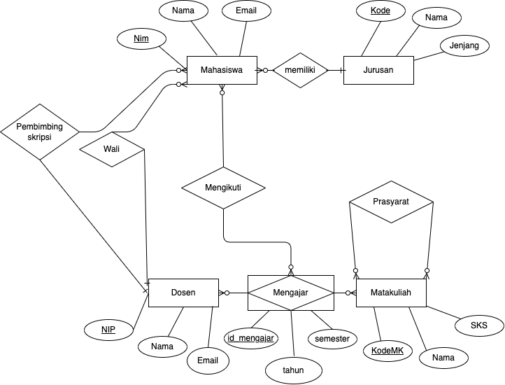

## Kerjakan Soal Terkait Materi Minggu Ke 5-6

Dosen pengampu *Arif Wicaksono Septyanto, M.Kom*

Indikator penilaian :

- Ketepatan mahasiswa memahami dan menggunakan SQL

Soal :




Implementasikan rancangan ERD diatas kedalam database menggunakan SQLa
contoh :

1. tabel jurusan

```sql
MariaDB [kampus]> CREATE TABLE jurusan (
-> kode INT PRIMARY KEY,
-> nama VARCHAR(255),
-> jenjang VARCHAR(50)
-> );
Query OK, 0 rows affected (0.006 sec)
```
